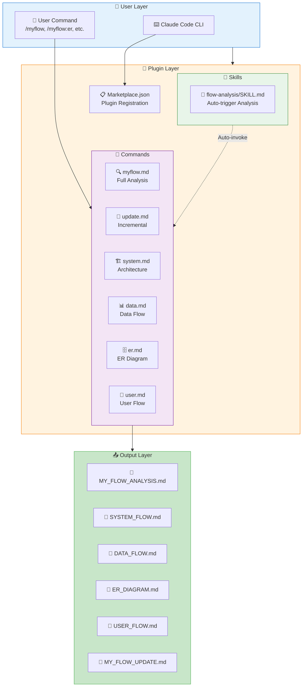
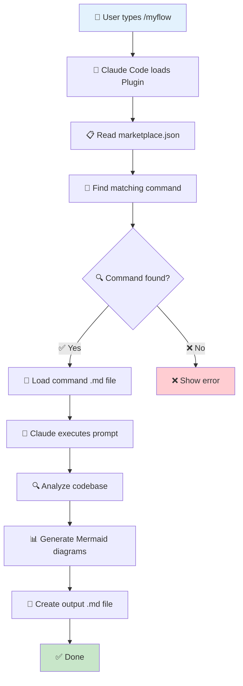
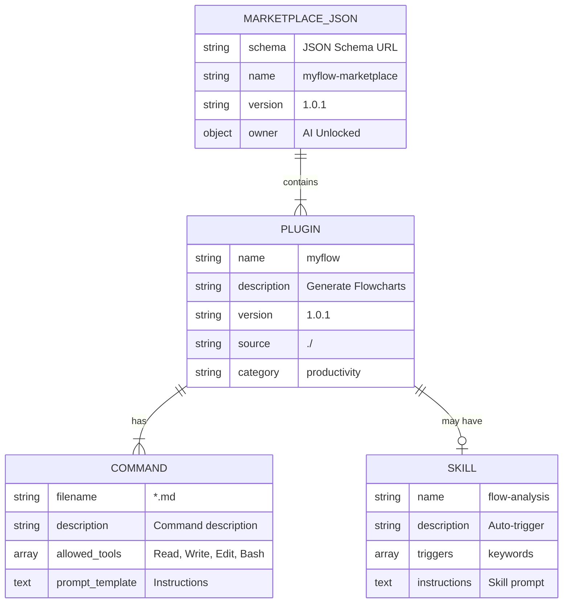
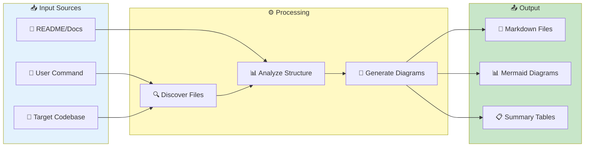
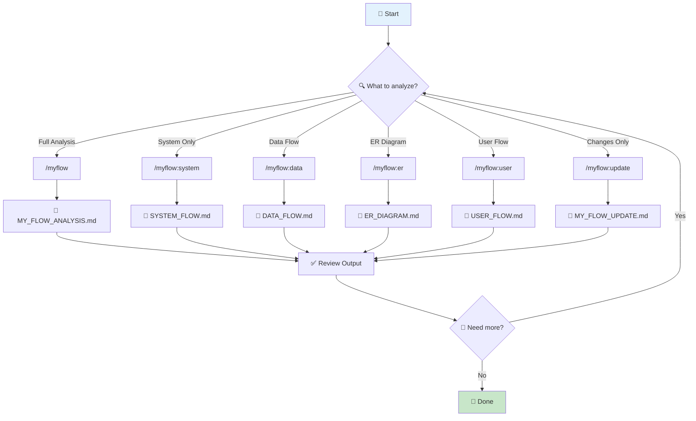
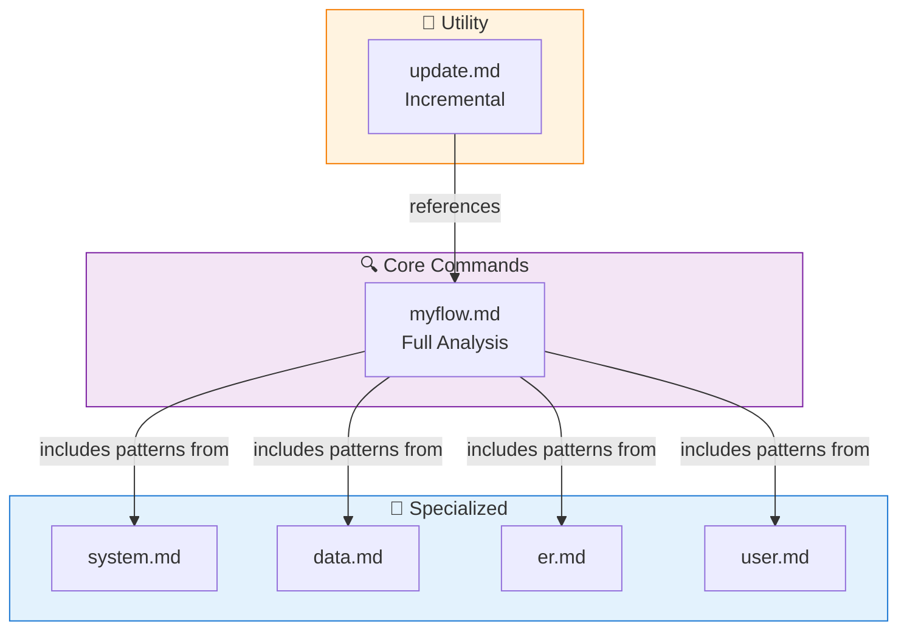
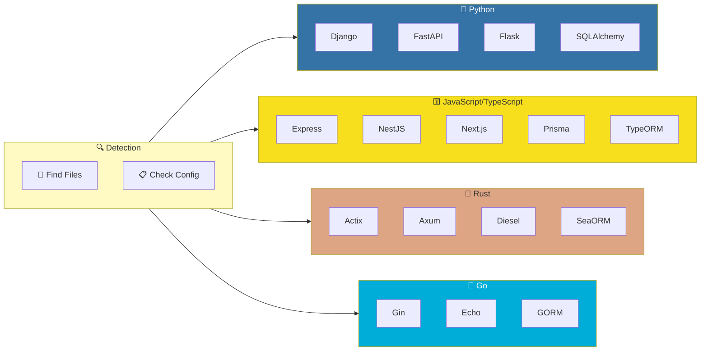

# 🔄 My Flow - Project Analysis

> 📅 Generated: December 24, 2025
> 📁 Project: myflow-plugin
> 🛠️ Stack: Claude Code Plugin (Markdown-based)

---

## 📊 Project Overview

| รายการ | รายละเอียด |
|--------|------------|
| **ประเภท** | Claude Code Plugin |
| **ภาษาหลัก** | Markdown (Command Templates) |
| **Framework** | Claude Code Plugin System |
| **Architecture** | Command-based Plugin |
| **Version** | 1.0.1 |
| **License** | MIT |

---

## 🏗️ System Architecture Flow

---

## 🔄 Plugin Execution Flow

---

## 📦 Key Components

### 📋 Configuration Files
| ไฟล์ | Path | หน้าที่ |
|------|------|--------|
| marketplace.json | `.claude-plugin/marketplace.json` | Plugin manifest สำหรับ Claude Code Marketplace |

### 📁 Commands
| ไฟล์ | Command | หน้าที่ |
|------|---------|--------|
| myflow.md | `/myflow` | วิเคราะห์โปรเจกต์แบบครบวงจร (Default) |
| update.md | `/myflow:update` | อัพเดทเฉพาะส่วนที่เปลี่ยนแปลง |
| system.md | `/myflow:system` | สร้าง System Architecture Flowchart |
| data.md | `/myflow:data` | สร้าง Data Flow Diagram |
| er.md | `/myflow:er` | สร้าง ER Diagram |
| user.md | `/myflow:user` | สร้าง User Journey/User Flow |

### 🎯 Skills
| ไฟล์ | Path | หน้าที่ |
|------|------|--------|
| SKILL.md | `skills/flow-analysis/SKILL.md` | Auto-trigger เมื่อผู้ใช้ต้องการวิเคราะห์โปรเจกต์ |

---

## 🗄️ Plugin Structure (ER-style)

---

## 📊 Data Flow

---

## 👤 User Flow

---

## 🔗 Command Dependencies

---

## 🔧 Supported Frameworks Detection

---

## 📋 Output File Specifications

| Output File | Command | Content |
|-------------|---------|---------|
| `MY_FLOW_ANALYSIS.md` | `/myflow` | Complete analysis with all diagrams |
| `SYSTEM_FLOW.md` | `/myflow:system` | System architecture, request flow, service communication |
| `DATA_FLOW.md` | `/myflow:data` | Data sources, processing, storage, CRUD flows |
| `ER_DIAGRAM.md` | `/myflow:er` | Entity relationships, table details, indexes |
| `USER_FLOW.md` | `/myflow:user` | User journeys, registration, login, navigation |
| `MY_FLOW_UPDATE.md` | `/myflow:update` | Changes since last analysis, changelogs |

---

## 💡 Notes & Recommendations

### 👍 Strengths
1. **Modular Commands** - แยก command เป็นไฟล์ ทำให้ maintain ง่าย
2. **Comprehensive Templates** - มี template พร้อมใช้สำหรับทุกประเภท diagram
3. **Multi-framework Support** - รองรับหลายภาษาและ framework
4. **Incremental Update** - มี `/myflow:update` สำหรับอัพเดทเฉพาะส่วนที่เปลี่ยน
5. **Bilingual Documentation** - README มีทั้งภาษาไทยและอังกฤษ

### 📝 Future Enhancements
1. เพิ่ม command สำหรับ Sequence Diagram
2. เพิ่ม Class Diagram generator
3. รองรับ C#/.NET และ Ruby on Rails เพิ่มเติม
4. เพิ่ม API documentation generator

---

## 🔒 Security Considerations

- Plugin ใช้เฉพาะ `Read, Write, Edit, Bash` tools
- ไม่มีการส่งข้อมูลออกนอกระบบ
- Output files สร้างใน directory ของโปรเจกต์เท่านั้น

---

Made with ❤️ by **AI Unlocked** | Version 1.0.1
