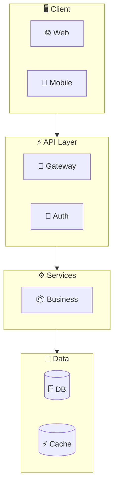
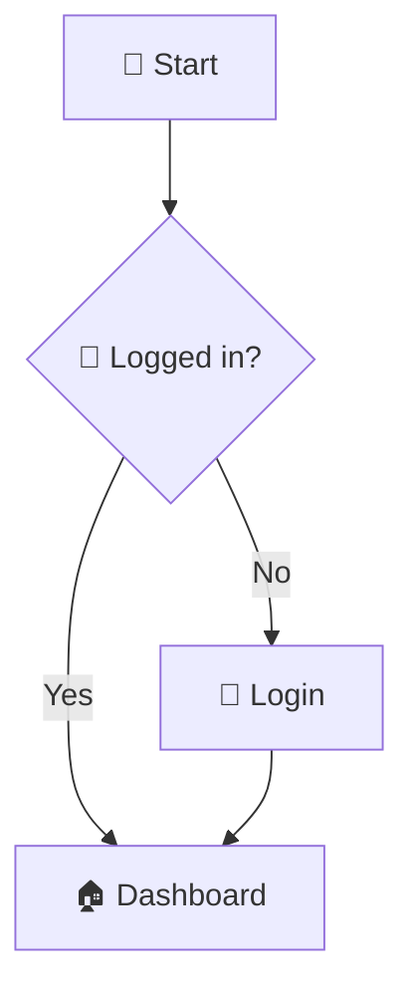
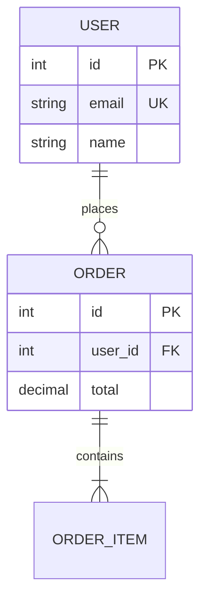

# 🔄 My Flow - Claude Code Plugin

> **EN:** Generate beautiful Flowcharts from your project - System Flow, User Flow, Data Flow, ER Diagram  
> **TH:** สร้าง Flowchart สวยงามจากโปรเจกต์ - System Flow, User Flow, Data Flow, ER Diagram

[]()
[](https://docs.claude.com)

**[English](#english)** | **[ภาษาไทย](#ภาษาไทย)**

---

# English

## ✨ Features

| Command | Description |
|---------|-------------|
| 🔍 `/myflow` | **Full project analysis** (Default) |
| 🔄 `/myflow:update` | **Incremental update** - only changes since last analysis |
| 🏗️ `/myflow:system` | Generate System Architecture Flow |
| 👤 `/myflow:user` | Generate User Journey / User Flow |
| 📊 `/myflow:data` | Generate Data Flow Diagram |
| 🗄️ `/myflow:er` | Generate ER Diagram |

## 🚀 Installation

### Option 1: Install via Git (Recommended)

```bash
# Clone plugin to your plugins directory
git clone https://github.com/aiunlocked1412/myflow-plugin.git ~/.claude/plugins/myflow-plugin

# Or clone to test locally first
git clone https://github.com/aiunlocked1412/myflow-plugin.git
claude --plugin-dir ./myflow-plugin
```

### Option 2: Install via Claude Code CLI

```bash
# Open Claude Code
claude

# Add marketplace from GitHub
/plugin
# Tab to "Marketplaces" → "+ Add Marketplace"
# Enter: aiunlocked1412/myflow-plugin
```

### Option 3: Project-specific Installation

```bash
# Install for current project only
cd your-project
git clone https://github.com/aiunlocked1412/myflow-plugin.git .claude/plugins/myflow-plugin
```

### 📍 Installation Paths

| Scope | Path | Usage |
|-------|------|-------|
| **User** | `~/.claude/plugins/myflow-plugin/` | Available in all projects |
| **Project** | `./.claude/plugins/myflow-plugin/` | Current project only |
| **Temporary** | `claude --plugin-dir ./myflow-plugin` | Testing |

### 🔄 Update Plugin

```bash
cd ~/.claude/plugins/myflow-plugin
git pull
```

## 📖 Usage

### Full Project Analysis (Default)
```
/myflow
```
Creates `MY_FLOW_ANALYSIS.md` with:
- System Architecture
- User Flows
- Data Flows
- ER Diagram

### Incremental Update (Only Changes)
```
/myflow:update
```
Creates `MY_FLOW_UPDATE.md` with:
- Summary of changes since last analysis
- New/Modified/Deleted components
- Updated diagrams highlighting changes
- Changelog with 🆕 ✏️ 🗑️ markers

**Uses:**
- Git diff (if available) - most accurate
- File timestamps (fallback)

### Generate System Architecture
```
/myflow:system
```
Creates `SYSTEM_FLOW.md`

### Generate User Flow
```
/myflow:user
```
Creates `USER_FLOW.md`

### Generate Data Flow
```
/myflow:data
```
Creates `DATA_FLOW.md`

### Generate ER Diagram
```
/myflow:er
```
Creates `ER_DIAGRAM.md`

## 📁 Plugin Structure

```
myflow-plugin/
├── .claude-plugin/
│   └── plugin.json          # Plugin manifest
├── commands/
│   ├── myflow.md            # /myflow (Default - Full Analysis)
│   ├── update.md            # /myflow:update (Incremental Update)
│   ├── system.md            # /myflow:system
│   ├── user.md              # /myflow:user
│   ├── data.md              # /myflow:data
│   └── er.md                # /myflow:er
├── skills/
│   └── flow-analysis/
│       └── SKILL.md         # Auto-invoked skill
└── README.md
```

## 🎨 Output Examples

### System Architecture Flow


### User Flow


### ER Diagram


## 🔧 Supported Frameworks

| Language | Frameworks |
|----------|------------|
| 🐍 Python | Django, FastAPI, Flask, SQLAlchemy |
| 🟨 JavaScript | Express, NestJS, Next.js |
| 🔷 TypeScript | Prisma, TypeORM, Drizzle |
| 🦀 Rust | Actix, Axum, Rocket, Diesel, SeaORM |
| 🔵 Go | Gin, Echo, GORM |
| ☕ Java | Spring Boot, JPA |
| 🐘 PHP | Laravel, Symfony |

## 💡 Tips

1. **Reads README first** - Plugin always reads project docs before analysis
2. **Excludes blog/content** - Skips markdown that is content, not documentation
3. **Mermaid Ready** - Output renders in GitHub, VS Code, Notion
4. **Uses Emoji** - Makes diagrams easy to read and beautiful

---

# ภาษาไทย

## ✨ ความสามารถ

| คำสั่ง | รายละเอียด |
|--------|------------|
| 🔍 `/myflow` | **วิเคราะห์โปรเจกต์ทั้งหมด** (Default) |
| 🔄 `/myflow:update` | **อัพเดทเฉพาะส่วนที่เปลี่ยน** - ไม่ต้อง analyze ใหม่ทั้งหมด |
| 🏗️ `/myflow:system` | สร้าง System Architecture Flow |
| 👤 `/myflow:user` | สร้าง User Journey / User Flow |
| 📊 `/myflow:data` | สร้าง Data Flow Diagram |
| 🗄️ `/myflow:er` | สร้าง ER Diagram |

## 🚀 การติดตั้ง

### วิธีที่ 1: ติดตั้งผ่าน Git (แนะนำ)

```bash
# Clone plugin ไปยัง plugins directory
git clone https://github.com/aiunlocked1412/myflow-plugin.git ~/.claude/plugins/myflow-plugin

# หรือ clone มาทดสอบก่อน
git clone https://github.com/aiunlocked1412/myflow-plugin.git
claude --plugin-dir ./myflow-plugin
```

### วิธีที่ 2: ติดตั้งผ่าน Claude Code CLI

```bash
# เปิด Claude Code
claude

# เพิ่ม marketplace จาก GitHub
/plugin
# กด Tab ไปที่ "Marketplaces" → "+ Add Marketplace"
# ใส่: aiunlocked1412/myflow-plugin
```

### วิธีที่ 3: ติดตั้งเฉพาะโปรเจกต์

```bash
# ติดตั้งสำหรับโปรเจกต์ปัจจุบันเท่านั้น
cd your-project
git clone https://github.com/aiunlocked1412/myflow-plugin.git .claude/plugins/myflow-plugin
```

### 📍 Paths การติดตั้ง

| Scope | Path | การใช้งาน |
|-------|------|----------|
| **User** | `~/.claude/plugins/myflow-plugin/` | ใช้ได้ทุกโปรเจกต์ |
| **Project** | `./.claude/plugins/myflow-plugin/` | เฉพาะโปรเจกต์นี้ |
| **ทดสอบ** | `claude --plugin-dir ./myflow-plugin` | ทดสอบชั่วคราว |

### 🔄 อัพเดท Plugin

```bash
cd ~/.claude/plugins/myflow-plugin
git pull
```

## 📖 วิธีใช้งาน

### วิเคราะห์โปรเจกต์ทั้งหมด (Default)
```
/myflow
```
สร้างไฟล์ `MY_FLOW_ANALYSIS.md` ที่มี:
- System Architecture
- User Flows
- Data Flows
- ER Diagram

### อัพเดทเฉพาะส่วนที่เปลี่ยน
```
/myflow:update
```
สร้างไฟล์ `MY_FLOW_UPDATE.md` ที่มี:
- สรุปการเปลี่ยนแปลงตั้งแต่ครั้งก่อน
- Components ที่เพิ่ม/แก้ไข/ลบ
- Diagrams ที่อัพเดทพร้อม highlight สิ่งใหม่
- Changelog พร้อม markers 🆕 ✏️ 🗑️

**ใช้:**
- Git diff (ถ้ามี) - แม่นยำที่สุด
- File timestamps (fallback)

### สร้าง System Architecture
```
/myflow:system
```
สร้างไฟล์ `SYSTEM_FLOW.md`

### สร้าง User Flow
```
/myflow:user
```
สร้างไฟล์ `USER_FLOW.md`

### สร้าง Data Flow
```
/myflow:data
```
สร้างไฟล์ `DATA_FLOW.md`

### สร้าง ER Diagram
```
/myflow:er
```
สร้างไฟล์ `ER_DIAGRAM.md`

## 📁 โครงสร้าง Plugin

```
myflow-plugin/
├── .claude-plugin/
│   └── plugin.json          # Plugin manifest
├── commands/
│   ├── myflow.md            # /myflow (Default - วิเคราะห์ทั้งหมด)
│   ├── update.md            # /myflow:update (อัพเดทเฉพาะส่วนที่เปลี่ยน)
│   ├── system.md            # /myflow:system
│   ├── user.md              # /myflow:user
│   ├── data.md              # /myflow:data
│   └── er.md                # /myflow:er
├── skills/
│   └── flow-analysis/
│       └── SKILL.md         # Auto-invoked skill
└── README.md
```

## 🎨 ตัวอย่าง Output

### System Architecture Flow


### User Flow


### ER Diagram


## 🔧 Frameworks ที่รองรับ

| ภาษา | Frameworks |
|------|------------|
| 🐍 Python | Django, FastAPI, Flask, SQLAlchemy |
| 🟨 JavaScript | Express, NestJS, Next.js |
| 🔷 TypeScript | Prisma, TypeORM, Drizzle |
| 🦀 Rust | Actix, Axum, Rocket, Diesel, SeaORM |
| 🔵 Go | Gin, Echo, GORM |
| ☕ Java | Spring Boot, JPA |
| 🐘 PHP | Laravel, Symfony |

## 💡 เคล็ดลับ

1. **อ่าน README ก่อน** - Plugin จะอ่าน docs ของโปรเจกต์ก่อนวิเคราะห์เสมอ
2. **ไม่รวม blog/content** - ข้าม markdown ที่เป็น content ไม่ใช่ docs
3. **Mermaid Ready** - Output พร้อม render ใน GitHub, VS Code, Notion
4. **ใช้ Emoji** - ทำให้ diagram อ่านง่ายและสวยงาม

---

## 📝 License

MIT License

---

Made with ❤️ by **AI Unlocked**  
🌐 [aiunlock.co](https://aiunlock.co) | 📺 [@AIUnlocked168](https://youtube.com/@AIUnlocked168)
