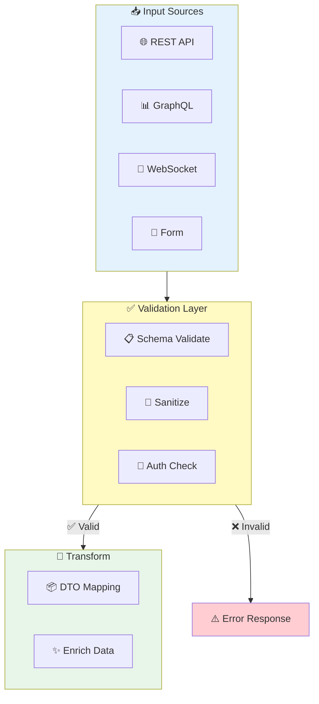
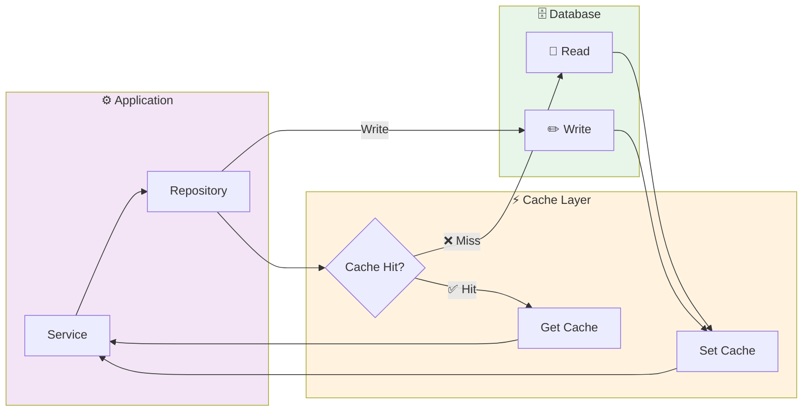
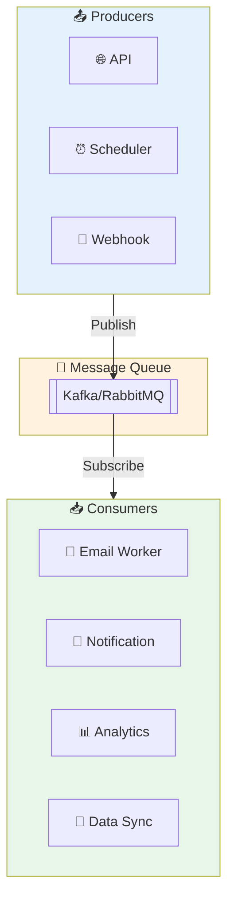
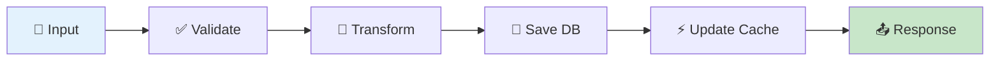
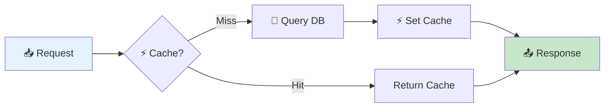
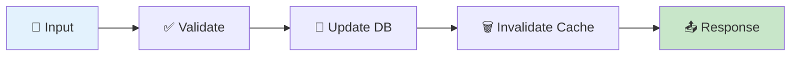
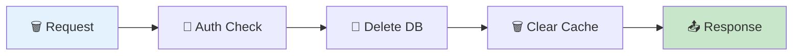
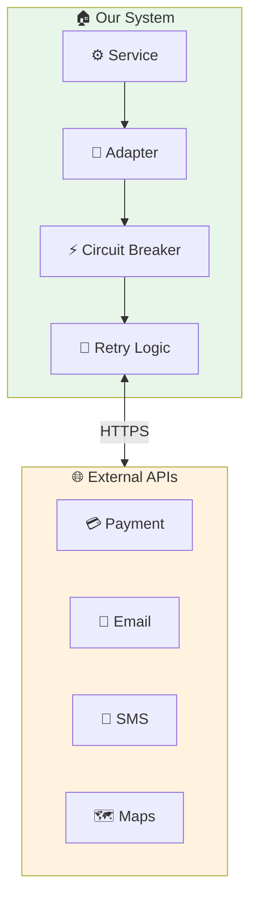
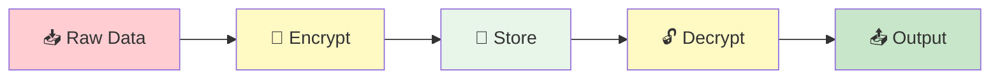

# 📊 Data Flow Generator

สร้าง Flowchart แสดงการไหลของข้อมูลในระบบ

## 📋 ขั้นตอน

### 1. ค้นหา Data Sources & Sinks
```bash
# 1. อ่าน Documentation ก่อน!
# ⚠️ ข้าม blog, content, posts
find . -maxdepth 3 -name "*.md" \
  ! -path "*/blog/*" ! -path "*/posts/*" ! -path "*/content/*" \
  ! -path "*/articles/*" ! -path "*/_posts/*" \
  | xargs grep -l -i "data\|api\|integration\|flow" 2>/dev/null | head -5

# 2. หา API endpoints
find . \( -name "*api*" -o -name "*route*" -o -name "*endpoint*" \) \
  ! -path "*/node_modules/*" | head -20

# 3. หา Services & Repositories
find . \( -name "*service*" -o -name "*repository*" -o -name "*dao*" \) \
  ! -path "*/node_modules/*" | head -20

# 4. หา External integrations
grep -r "axios\|fetch\|http\|request\|api" \
  --include="*.js" --include="*.ts" --include="*.py" \
  -l 2>/dev/null | head -20

# 5. หา Message Queue / Events
find . \( -name "*queue*" -o -name "*event*" -o -name "*kafka*" -o -name "*rabbit*" \) \
  ! -path "*/node_modules/*" | head -10

# 6. หา Cache config
grep -r "redis\|cache\|memcache" \
  --include="*.js" --include="*.ts" --include="*.py" --include="*.yaml" \
  -l 2>/dev/null | head -10
```

### 2. สร้างไฟล์ `DATA_FLOW.md`

```markdown
# 📊 Data Flow Diagrams

> 📅 Generated: [วันที่]  
> 📁 Project: [ชื่อ]

---

## 🎯 High-Level Data Flow

```mermaid
flowchart LR
    subgraph SOURCES["📥 Data Sources"]
        U["👤 User Input"]
        API["🌐 External API"]
        FILE["📁 File Upload"]
        WH["🔔 Webhook"]
    end

    subgraph INGESTION["🚪 Ingestion"]
        VAL["✅ Validate"]
        PARSE["📝 Parse"]
        NORM["🔄 Normalize"]
    end

    subgraph PROCESS["⚙️ Processing"]
        BIZ["📦 Business Logic"]
        TRANS["🔄 Transform"]
        ENRICH["✨ Enrich"]
    end

    subgraph STORAGE["💾 Storage"]
        DB[("🗄️ Database")]
        CACHE[("⚡ Cache")]
        S3["☁️ Object Store"]
        SEARCH["🔍 Search Index"]
    end

    subgraph OUTPUT["📤 Output"]
        RES["📬 API Response"]
        EMAIL["📧 Email"]
        PUSH["🔔 Push"]
        REPORT["📊 Report"]
    end

    SOURCES --> INGESTION
    INGESTION --> PROCESS
    PROCESS --> STORAGE
    STORAGE --> OUTPUT

    style SOURCES fill:#e3f2fd
    style INGESTION fill:#fff3e0
    style PROCESS fill:#f3e5f5
    style STORAGE fill:#e8f5e9
    style OUTPUT fill:#fce4ec
```



---

## 📥 Data Input Flow



---

## 💾 Database Operations Flow



---

## 🔄 Event-Driven Flow



---

## 🔁 CRUD Data Flow

### Create Flow


### Read Flow


### Update Flow


### Delete Flow


---

## 🌐 External Integration Flow



---

## 📊 Data Flow Summary

| Flow | Source | Process | Destination | Type |
|------|--------|---------|-------------|------|
| User Registration | Form | Validate → Hash → Save | DB + Email | Sync |
| Order Creation | API | Validate → Process → Save | DB + Queue | Sync + Async |
| Payment | Service | Adapter → External API | Payment Gateway | Sync |
| Notification | Queue | Consume → Process → Send | Email/Push | Async |

---

## 🔐 Data Security Flow


```

เริ่มสร้าง Data Flow ได้เลย! 🚀
