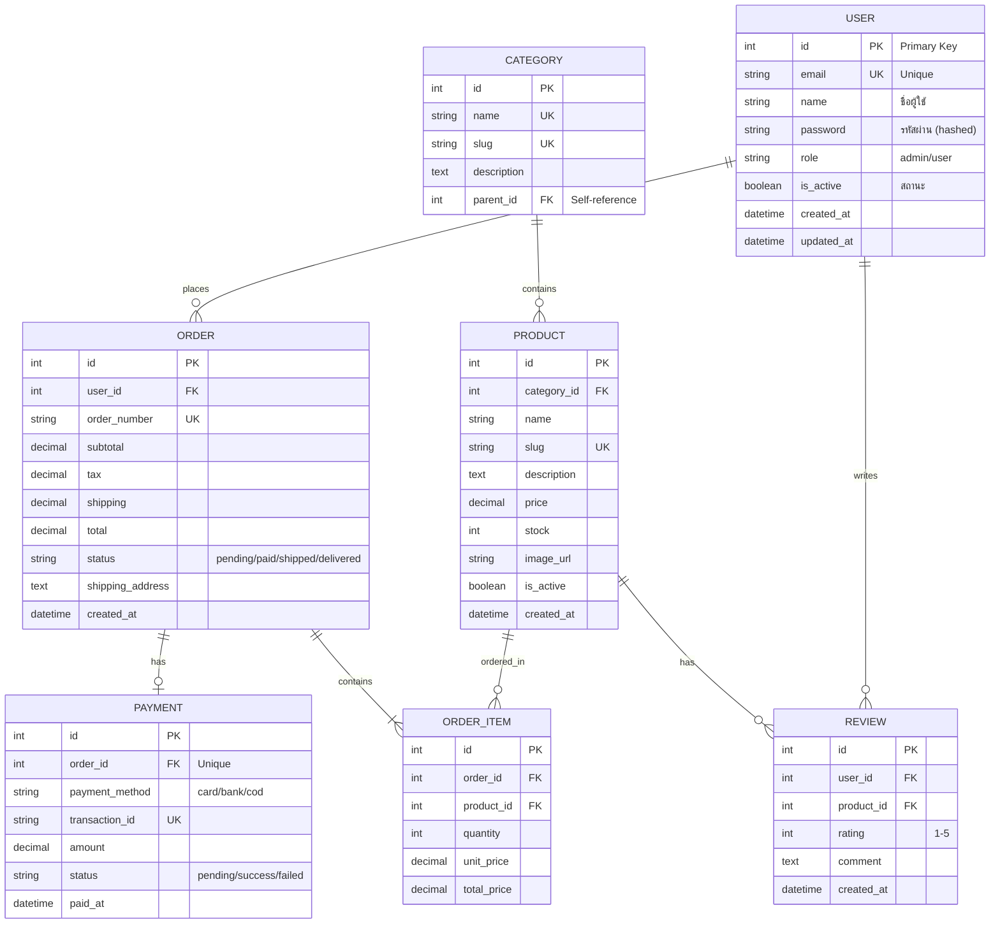

# 🗄️ ER Diagram Generator

สร้าง Entity Relationship Diagram จาก database models ในโปรเจกต์

## 📋 ขั้นตอน

### 1. ค้นหา Database Models
```bash
# 1. อ่าน Documentation เกี่ยวกับ Database ก่อน!
# ⚠️ ข้าม blog, content, posts - ไม่ใช่ docs ของโปรเจกต์
find . -maxdepth 3 -name "*.md" \
  ! -path "*/blog/*" ! -path "*/posts/*" ! -path "*/content/*" \
  ! -path "*/articles/*" ! -path "*/_posts/*" ! -path "*/news/*" \
  | xargs grep -l -i "database\|model\|schema\|entity\|table" 2>/dev/null | head -5

cat README.md docs/DATABASE.md docs/SCHEMA.md 2>/dev/null | head -100

# 2. Python (Django/SQLAlchemy/Tortoise)
find . \( -name "models.py" -o -name "*model*.py" -o -name "*schema*.py" \) \
  ! -path "*/node_modules/*" ! -path "*/.venv/*" | head -20

# 3. JavaScript/TypeScript (Prisma/TypeORM/Sequelize/Drizzle)
find . \( -name "*.prisma" -o -name "*entity*.ts" -o -name "*model*.ts" -o -name "*schema*.ts" \) \
  ! -path "*/node_modules/*" | head -20

# 4. Go (GORM/Ent)
find . \( -name "*model*.go" -o -name "*entity*.go" -o -name "*schema*.go" \) \
  ! -path "*/vendor/*" | head -20

# 5. Rust (Diesel/SeaORM)
find . \( -name "schema.rs" -o -name "*model*.rs" -o -name "*entity*.rs" \) \
  ! -path "*/target/*" | head -20
cat diesel.toml 2>/dev/null

# 6. Java (JPA/Hibernate)
find . \( -name "*Entity.java" -o -name "*Model.java" \) \
  ! -path "*/target/*" | head -20

# 7. PHP (Laravel/Doctrine)
find . \( -name "*.php" -path "*/Models/*" -o -name "*Entity.php" \) \
  ! -path "*/vendor/*" | head -20

# 8. SQL Migrations
find . \( -name "*.sql" -path "*/migrations/*" -o -name "*migration*.sql" \) \
  ! -path "*/node_modules/*" ! -path "*/target/*" | head -20
```

### 2. สร้างไฟล์ `ER_DIAGRAM.md`

```markdown
# 🗄️ Entity Relationship Diagram

> 📅 Generated: [วันที่]  
> 📁 Project: [ชื่อ]  
> 🗄️ Database: [PostgreSQL/MySQL/MongoDB/etc.]

---

## 📊 ER Diagram



---

## 📋 Entity Details

### 👤 USER
| Column | Type | Constraints | Description |
|--------|------|-------------|-------------|
| `id` | INT | PK, AUTO_INCREMENT | รหัสผู้ใช้ |
| `email` | VARCHAR(255) | UNIQUE, NOT NULL | อีเมล |
| `name` | VARCHAR(100) | NOT NULL | ชื่อผู้ใช้ |
| `password` | VARCHAR(255) | NOT NULL | รหัสผ่าน (hashed) |
| `role` | ENUM | DEFAULT 'user' | admin, user |
| `is_active` | BOOLEAN | DEFAULT true | สถานะ |
| `created_at` | DATETIME | DEFAULT NOW() | วันที่สร้าง |
| `updated_at` | DATETIME | ON UPDATE NOW() | วันที่แก้ไข |

**Indexes:**
- `idx_user_email` (email) - UNIQUE
- `idx_user_role` (role)

**Relationships:**
- `USER` 1:N `ORDER`
- `USER` 1:N `REVIEW`

---

### 📦 PRODUCT
| Column | Type | Constraints | Description |
|--------|------|-------------|-------------|
| `id` | INT | PK | รหัสสินค้า |
| `category_id` | INT | FK → CATEGORY | หมวดหมู่ |
| `name` | VARCHAR(200) | NOT NULL | ชื่อสินค้า |
| `slug` | VARCHAR(200) | UNIQUE | URL slug |
| `price` | DECIMAL(10,2) | NOT NULL | ราคา |
| `stock` | INT | DEFAULT 0 | จำนวนคงเหลือ |

**Indexes:**
- `idx_product_category` (category_id)
- `idx_product_slug` (slug) - UNIQUE

---

[เพิ่ม Entity อื่นๆ ตามที่พบ...]

---

## 🔗 Relationship Summary

| From | To | Type | FK Column | Description |
|------|-----|------|-----------|-------------|
| USER | ORDER | 1:N | order.user_id | ผู้ใช้ → ออเดอร์ |
| USER | REVIEW | 1:N | review.user_id | ผู้ใช้ → รีวิว |
| CATEGORY | PRODUCT | 1:N | product.category_id | หมวดหมู่ → สินค้า |
| PRODUCT | ORDER_ITEM | 1:N | order_item.product_id | สินค้า → รายการ |
| ORDER | ORDER_ITEM | 1:N | order_item.order_id | ออเดอร์ → รายการ |
| ORDER | PAYMENT | 1:1 | payment.order_id | ออเดอร์ → การชำระ |

---

## 📐 Relationship Types (Mermaid)

| Symbol | Meaning |
|--------|---------|
| `\|\|--\|\|` | 1 to 1 |
| `\|\|--o{` | 1 to Many |
| `}o--o{` | Many to Many |
| `\|\|--o\|` | 1 to 0 or 1 |

**Field Markers:**
- `PK` = Primary Key
- `FK` = Foreign Key
- `UK` = Unique Key

---

## 📊 Database Info

| Item | Value |
|------|-------|
| **Total Tables** | [จำนวน] |
| **Total Relationships** | [จำนวน] |
| **Database Type** | [PostgreSQL/MySQL/etc.] |
| **ORM** | [Prisma/TypeORM/etc.] |
```

---

## ⚠️ กฎสำคัญ

1. **ครอบคลุมทุก Entity** ที่พบในโปรเจกต์
2. **ระบุ PK, FK, UK** ให้ครบถ้วน
3. **Relationship ต้องถูกต้อง** - 1:1, 1:N, N:M
4. **Mermaid Syntax ต้อง Render ได้**
5. **ใช้ภาษาไทย** ในคำอธิบาย

เริ่มสร้าง ER Diagram ได้เลย! 🚀
