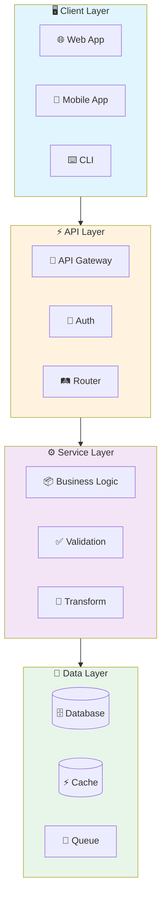
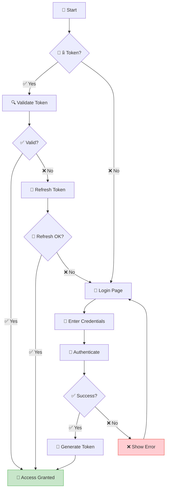
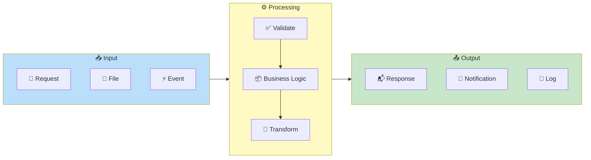
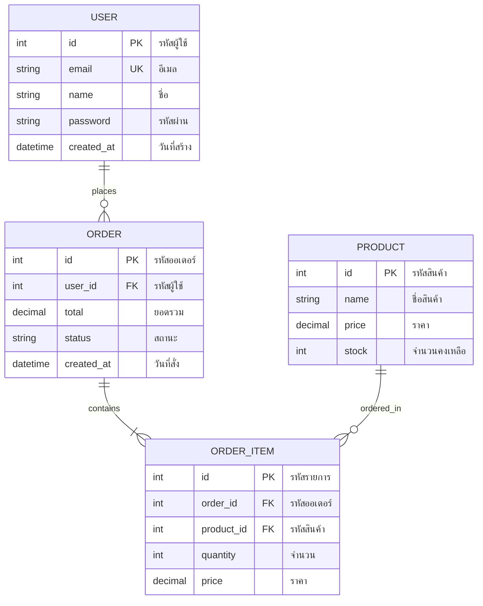
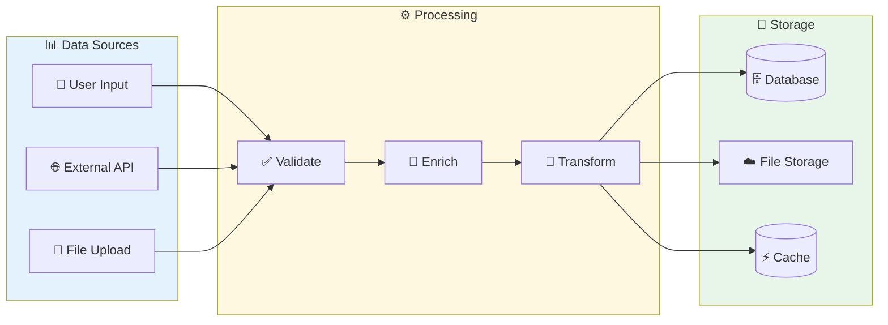

# 🔍 My Flow - Full Project Analysis

คุณคือผู้เชี่ยวชาญด้าน System Design และ Documentation ทำการวิเคราะห์โปรเจกต์แบบครบวงจร

## 📋 ขั้นตอนการทำงาน

### Step 1: สำรวจโปรเจกต์
```bash
# 1. อ่าน Documentation ก่อน (สำคัญมาก!)
# ⚠️ ข้าม blog, content, posts, articles - ไม่ใช่ docs ของโปรเจกต์
find . -maxdepth 3 -type f -name "*.md" \
  ! -path "*/blog/*" ! -path "*/posts/*" ! -path "*/content/*" \
  ! -path "*/articles/*" ! -path "*/_posts/*" ! -path "*/news/*" \
  | head -20
  
# อ่าน README และ docs หลัก
cat README.md 2>/dev/null
cat ARCHITECTURE.md CONTRIBUTING.md docs/README.md 2>/dev/null | head -100

# 2. หาไฟล์ code ทั้งหมด
find . -type f \( -name "*.py" -o -name "*.js" -o -name "*.ts" -o -name "*.tsx" -o -name "*.jsx" -o -name "*.java" -o -name "*.go" -o -name "*.php" -o -name "*.rb" -o -name "*.rs" \) \
  ! -path "*/node_modules/*" ! -path "*/.git/*" ! -path "*/vendor/*" ! -path "*/dist/*" ! -path "*/target/*" \
  | head -100

# 3. หา config files
ls -la package.json requirements.txt go.mod pom.xml composer.json Gemfile Cargo.toml pyproject.toml 2>/dev/null
cat package.json 2>/dev/null | head -50

# 4. หา routes/controllers
find . \( -name "*route*" -o -name "*controller*" -o -name "*handler*" -o -name "*endpoint*" \) \
  ! -path "*/node_modules/*" | head -20

# 5. หา models/schemas
find . \( -name "*model*" -o -name "*entity*" -o -name "*.prisma" -o -name "*schema*" -o -name "*migration*" \) \
  ! -path "*/node_modules/*" | head -20

# 6. หา diagrams ที่มีอยู่แล้ว
find . \( -name "*.mermaid" -o -name "*diagram*" -o -name "*flow*" \) \
  ! -path "*/node_modules/*" | head -10
```

### Step 2: วิเคราะห์และสร้าง Output

สร้างไฟล์ `MY_FLOW_ANALYSIS.md` ตามรูปแบบนี้:

---

```markdown
# 🔄 My Flow - Project Analysis

> 📅 Generated: [วันที่]  
> 📁 Project: [ชื่อโปรเจกต์]  
> 🛠️ Stack: [Tech Stack]

---

## 📊 Project Overview

| รายการ | รายละเอียด |
|--------|------------|
| **ภาษาหลัก** | [ภาษา] |
| **Framework** | [Framework] |
| **Database** | [DB Type] |
| **Architecture** | [Pattern] |

---

## 🏗️ System Architecture Flow



---

## 🔐 Authentication Flow



---

## 🔄 Main Business Flow



---

## 🗄️ ER Diagram



---

## 📊 Data Flow



---

## 📦 Key Components

### Controllers/Handlers
| ชื่อ | Path | หน้าที่ |
|------|------|--------|
| ... | ... | ... |

### Services
| ชื่อ | Path | หน้าที่ |
|------|------|--------|
| ... | ... | ... |

### Models
| ชื่อ | Path | หน้าที่ |
|------|------|--------|
| ... | ... | ... |

---

## 🔗 API Endpoints

| Method | Endpoint | Flow | Description |
|--------|----------|------|-------------|
| POST | /auth/login | Auth Flow | เข้าสู่ระบบ |
| GET | /users | User Flow | ดึงข้อมูลผู้ใช้ |
| POST | /orders | Order Flow | สร้างออเดอร์ |

---

## 💡 Notes & Recommendations

[ข้อเสนอแนะ]
```

---

## ⚠️ กฎสำคัญ

1. **Mermaid ต้อง Render ได้** - ตรวจสอบ syntax ก่อนส่ง
2. **ใช้ Emoji** ทำให้อ่านง่ายและสวยงาม
3. **ใช้สี** แยก subgraph ด้วย `style`
4. **ครอบคลุมทุก Flow** ที่พบในโปรเจกต์
5. **ภาษาไทย** ในคำอธิบาย, อังกฤษใน diagram

เริ่มวิเคราะห์โปรเจกต์ได้เลย! 🚀
