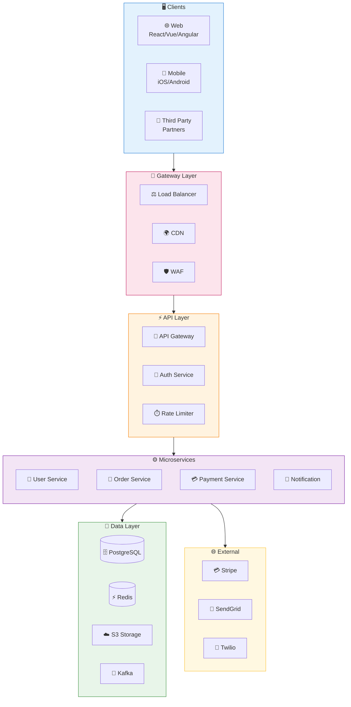
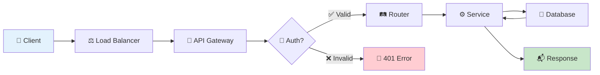
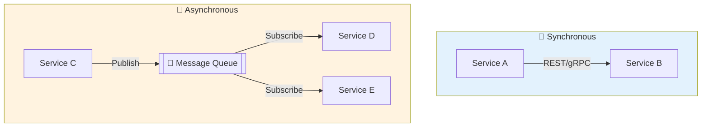
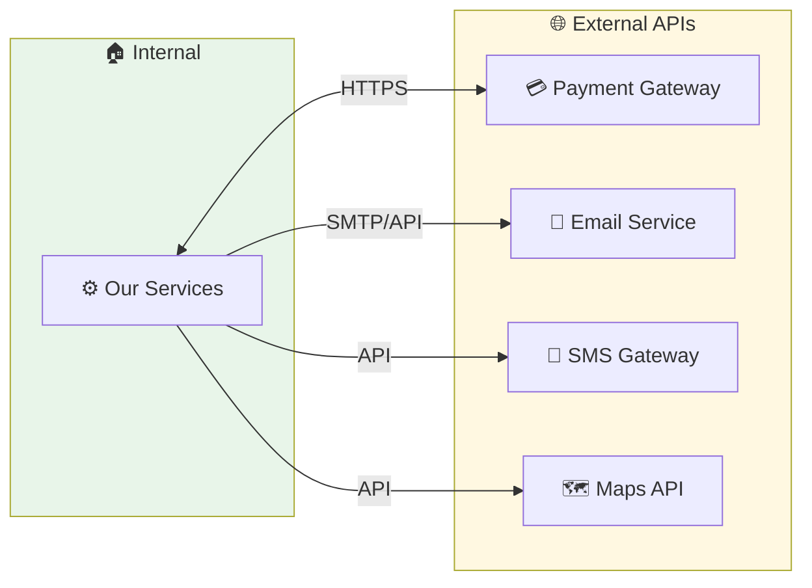

# 🏗️ System Architecture Flow Generator

สร้าง Flowchart แสดงโครงสร้างระบบทั้งหมด

## 📋 ขั้นตอน

### 1. ค้นหา Components
```bash
# 1. อ่าน Documentation ก่อน!
# ⚠️ ข้าม blog, content, posts - ไม่ใช่ docs ของโปรเจกต์
find . -maxdepth 3 -name "*.md" \
  ! -path "*/blog/*" ! -path "*/posts/*" ! -path "*/content/*" \
  ! -path "*/articles/*" ! -path "*/_posts/*" ! -path "*/news/*" \
  | xargs grep -l -i "architect\|system\|overview\|structure" 2>/dev/null | head -5
  
cat README.md ARCHITECTURE.md docs/SYSTEM.md docs/OVERVIEW.md 2>/dev/null | head -100

# 2. Entry points
find . \( -name "main.*" -o -name "app.*" -o -name "index.*" -o -name "server.*" \) \
  ! -path "*/node_modules/*" ! -path "*/dist/*" | head -10

# 3. Routes & Controllers
find . \( -name "*route*" -o -name "*controller*" -o -name "*handler*" \) \
  ! -path "*/node_modules/*" | head -20

# 4. Services & Repositories
find . \( -name "*service*" -o -name "*repository*" -o -name "*usecase*" \) \
  ! -path "*/node_modules/*" | head -20

# 5. Config & Infrastructure
find . \( -name "*.env*" -o -name "*config*" -o -name "docker-compose*" -o -name "Dockerfile" \) \
  ! -path "*/node_modules/*" | head -10
cat docker-compose.yml docker-compose.yaml 2>/dev/null | head -50
```

### 2. สร้างไฟล์ `SYSTEM_FLOW.md`

```markdown
# 🏗️ System Architecture Flow

> 📅 Generated: [วันที่]  
> 📁 Project: [ชื่อ]

---

## 🎯 High-Level Architecture



---

## 🔄 Request Flow



---

## 📦 Service Communication



---

## 🗂️ Layer Details

### Gateway Layer
| Component | Technology | Purpose |
|-----------|------------|---------|
| Load Balancer | Nginx/ALB | จัดการ traffic |
| CDN | CloudFront | Cache static files |
| WAF | AWS WAF | Security |

### Service Layer
| Service | Port | Responsibility |
|---------|------|----------------|
| ... | ... | ... |

### Data Layer
| Store | Type | Usage |
|-------|------|-------|
| ... | ... | ... |

---

## 🔗 Integration Points


```

---

## 🎨 Style Guide

ใช้สีตาม Layer:
- 🔵 Client: `#e3f2fd`
- 🟠 API: `#fff3e0`  
- 🟣 Service: `#f3e5f5`
- 🟢 Data: `#e8f5e9`
- 🟡 External: `#fff8e1`
- 🔴 Error: `#ffcdd2`
- 🟢 Success: `#c8e6c9`

เริ่มสร้าง System Flow ได้เลย! 🚀
