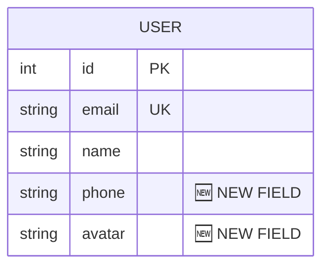
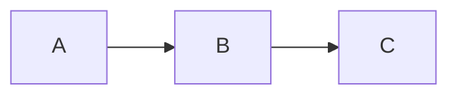
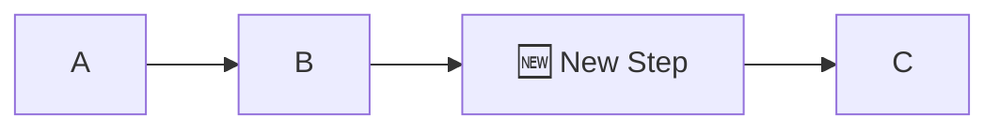
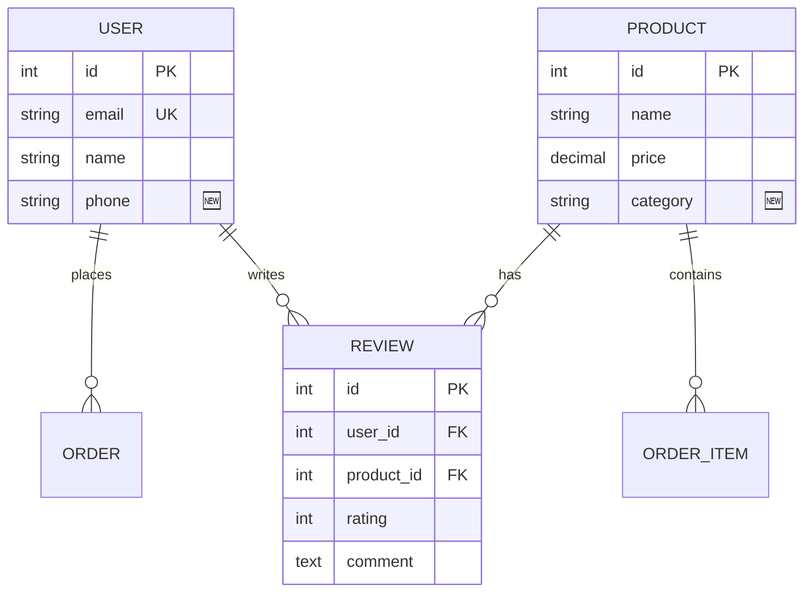
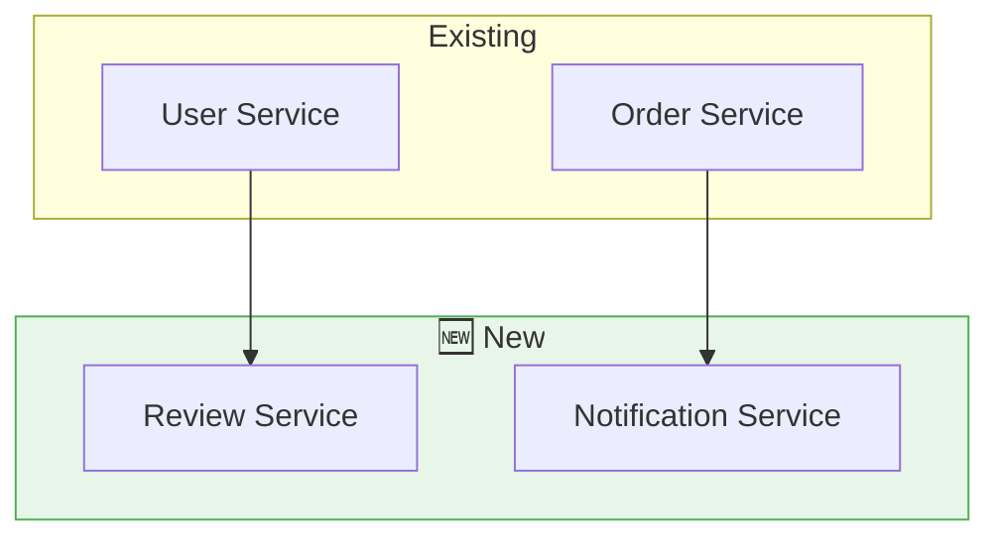

# 🔄 My Flow - Incremental Update

อัพเดท Analysis โดยดูเฉพาะไฟล์ที่เปลี่ยนแปลงตั้งแต่ครั้งก่อน ไม่ต้อง analyze ใหม่ทั้งหมด

## 📋 ขั้นตอนการทำงาน

### Step 1: หา Analysis เดิม
```bash
# หาไฟล์ analysis ที่มีอยู่
ls -la MY_FLOW_ANALYSIS.md SYSTEM_FLOW.md USER_FLOW.md DATA_FLOW.md ER_DIAGRAM.md 2>/dev/null

# ดูวันที่สร้าง/แก้ไขล่าสุด
stat MY_FLOW_ANALYSIS.md 2>/dev/null | grep -i modify
```

### Step 2: หาไฟล์ที่เปลี่ยนแปลง

#### วิธีที่ 1: ใช้ Git (แนะนำ)
```bash
# ดู commits ล่าสุด
git log --oneline -10

# หาไฟล์ที่เปลี่ยนตั้งแต่ commit ล่าสุดที่ analyze
git diff --name-only HEAD~5

# หาไฟล์ที่เปลี่ยนในช่วง 7 วันที่ผ่านมา
git log --since="7 days ago" --name-only --pretty=format: | sort -u | grep -v "^$"

# หาไฟล์ที่เปลี่ยนตั้งแต่วันที่กำหนด
git log --since="2024-01-01" --name-only --pretty=format: | sort -u

# ดู diff ของไฟล์ที่เปลี่ยน
git diff HEAD~5 --stat
```

#### วิธีที่ 2: ใช้ timestamp (ถ้าไม่มี Git)
```bash
# หาไฟล์ที่แก้ไขหลังจาก analysis ล่าสุด
find . -type f \( -name "*.py" -o -name "*.js" -o -name "*.ts" -o -name "*.go" -o -name "*.rs" \) \
  -newer MY_FLOW_ANALYSIS.md \
  ! -path "*/node_modules/*" ! -path "*/target/*" ! -path "*/.git/*"

# หาไฟล์ที่แก้ไขใน 7 วันที่ผ่านมา
find . -type f \( -name "*.py" -o -name "*.js" -o -name "*.ts" -o -name "*.go" -o -name "*.rs" \) \
  -mtime -7 \
  ! -path "*/node_modules/*" ! -path "*/target/*"
```

### Step 3: วิเคราะห์การเปลี่ยนแปลง

```bash
# หา models/entities ใหม่
git diff HEAD~5 --name-only | grep -E "(model|entity|schema)"

# หา routes/controllers ใหม่
git diff HEAD~5 --name-only | grep -E "(route|controller|handler)"

# หา migrations ใหม่
git diff HEAD~5 --name-only | grep -E "(migration|migrate)"

# ดูรายละเอียด diff ของไฟล์ที่สำคัญ
git diff HEAD~5 -- "*/models/*" "*/routes/*" "*/controllers/*"
```

### Step 4: สร้าง Update Report

สร้างไฟล์ `MY_FLOW_UPDATE.md` หรืออัพเดทไฟล์เดิม:

```markdown
# 🔄 My Flow - Update Report

> 📅 Updated: [วันที่]  
> 📅 Previous Analysis: [วันที่ก่อนหน้า]  
> 📁 Project: [ชื่อโปรเจกต์]

---

## 📊 Summary of Changes

| Category | Added | Modified | Deleted |
|----------|-------|----------|---------|
| Models/Entities | X | X | X |
| Routes/Controllers | X | X | X |
| Services | X | X | X |
| Migrations | X | X | X |

---

## 🆕 New Components

### New Models/Entities
| File | Entity Name | Description |
|------|-------------|-------------|
| `src/models/product.ts` | Product | สินค้าใหม่ |

### New Routes/Endpoints
| File | Method | Endpoint | Description |
|------|--------|----------|-------------|
| `src/routes/product.ts` | POST | /api/products | สร้างสินค้า |

### New Services
| File | Service Name | Description |
|------|--------------|-------------|
| ... | ... | ... |

---

## ✏️ Modified Components

### Modified Models


**Changes:**
- `USER`: เพิ่ม field `phone`, `avatar`
- `ORDER`: เปลี่ยน type ของ `status` เป็น enum

### Modified Flows

#### Before


#### After


---

## 🔄 Updated ER Diagram



---

## 🔄 Updated System Flow



---

## 📝 Changelog

### [วันที่]
- 🆕 Added: `Review` entity with user ratings
- 🆕 Added: `/api/reviews` endpoints
- ✏️ Modified: `User` model - added `phone`, `avatar` fields
- ✏️ Modified: `Product` model - added `category` field
- 🗑️ Removed: Deprecated `legacy_auth` routes

---

## ⚠️ Action Items

- [ ] อัพเดท API documentation สำหรับ `/api/reviews`
- [ ] เพิ่ม migration สำหรับ new fields
- [ ] อัพเดท frontend ให้รองรับ Review feature

---

## 🔗 Related Files Changed

| File | Type | Change |
|------|------|--------|
| `src/models/user.ts` | Model | Modified |
| `src/models/review.ts` | Model | Added |
| `src/routes/review.ts` | Route | Added |
| `migrations/20240101_add_review.sql` | Migration | Added |
```

---

## 🎨 Legend

| Symbol | Meaning |
|--------|---------|
| 🆕 | New/Added |
| ✏️ | Modified |
| 🗑️ | Deleted/Removed |
| ⚠️ | Needs attention |

---

## 💡 Tips

1. **ใช้ Git** - ถ้าโปรเจกต์ใช้ Git จะได้ข้อมูลแม่นยำกว่า
2. **ระบุช่วงเวลา** - ถามผู้ใช้ว่าอยากดู changes ตั้งแต่เมื่อไหร่
3. **Focus on Important** - เน้นไฟล์ที่สำคัญ (models, routes, services)
4. **Highlight New** - ใช้ 🆕 เพื่อ highlight สิ่งใหม่

---

## ⚠️ ถ้าไม่มี Analysis เดิม

ถ้าไม่พบไฟล์ `MY_FLOW_ANALYSIS.md` ให้แจ้งผู้ใช้:

> "ไม่พบ Analysis เดิม แนะนำให้รัน `/myflow` ก่อนเพื่อสร้าง baseline analysis"

เริ่มหา changes ได้เลย! 🚀
