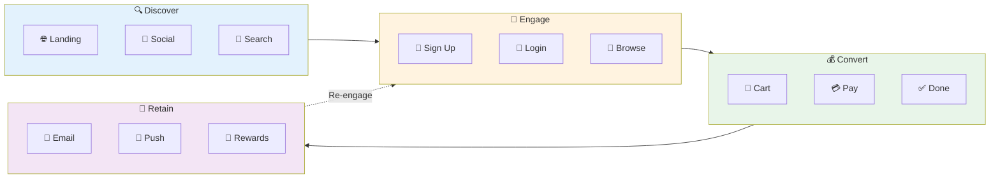
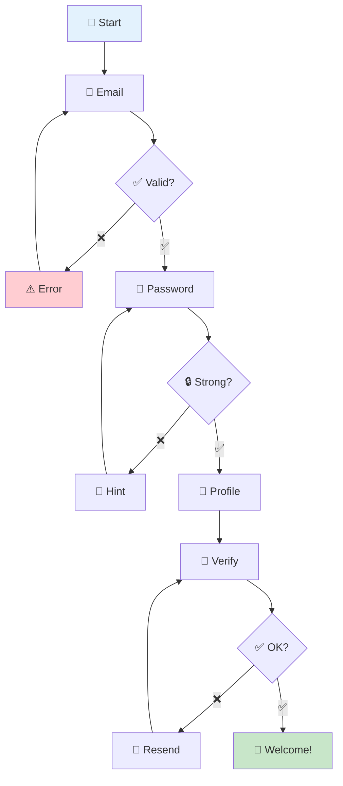
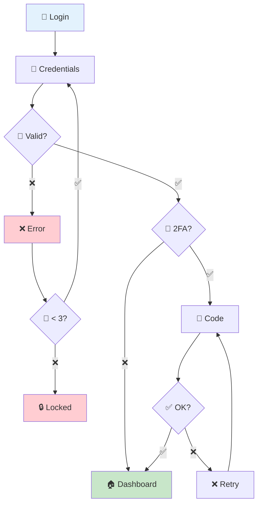
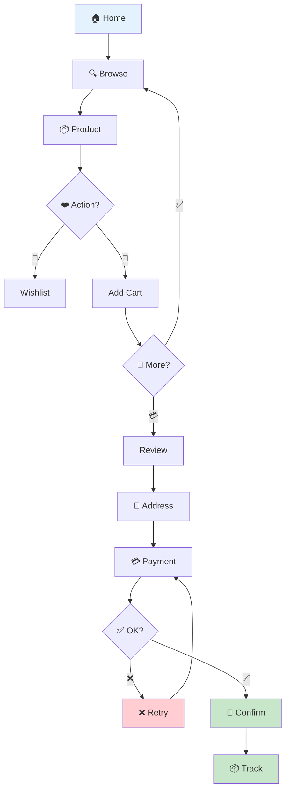
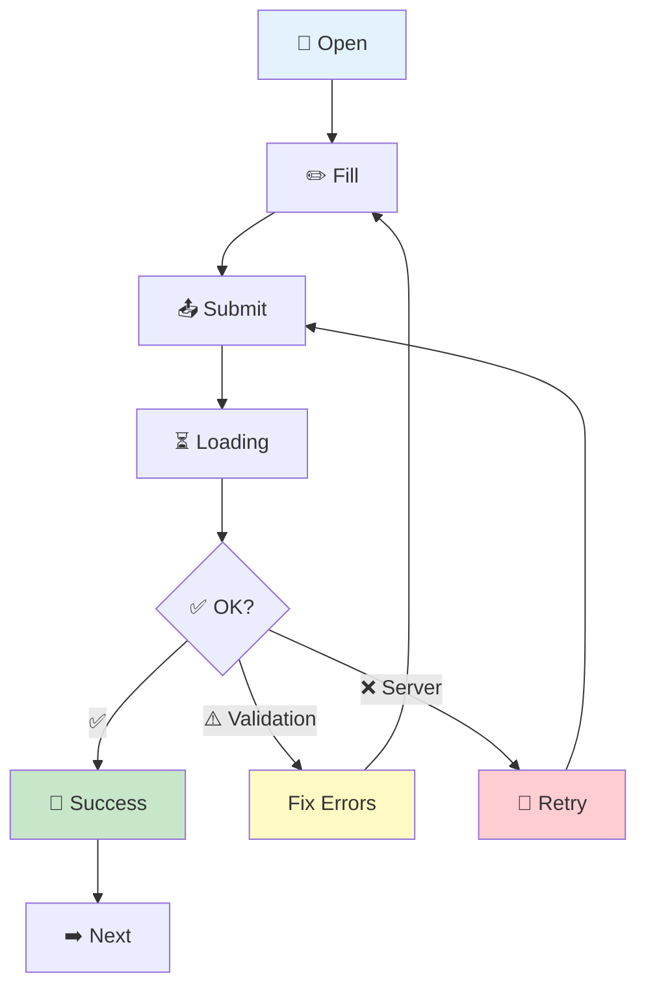
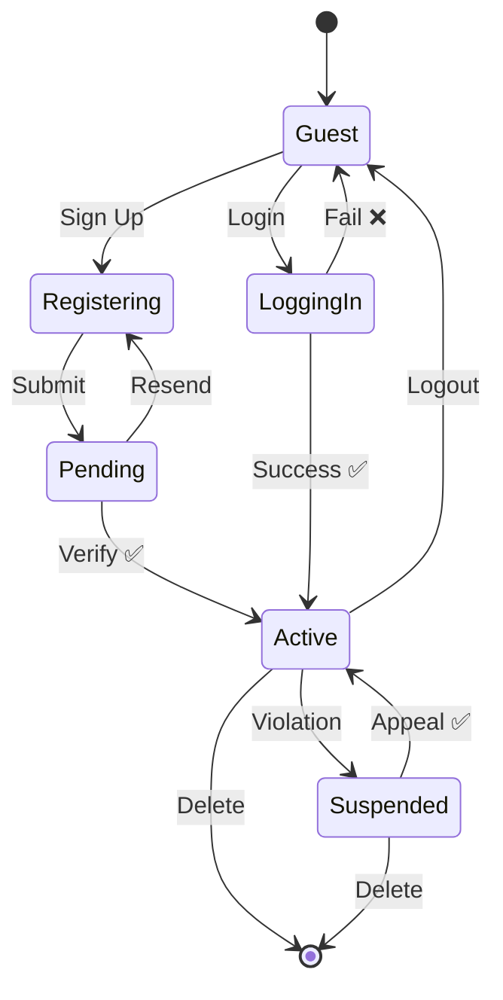
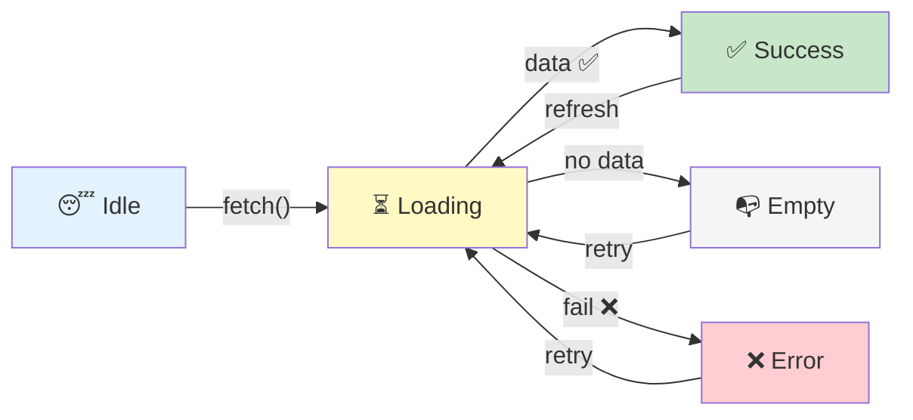
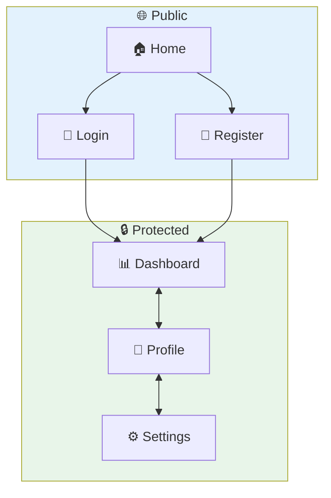

# 👤 User Flow Generator

สร้าง Flowchart แสดง User Journey และ User Experience Flow

## 📋 ขั้นตอน

### 1. ค้นหา User Interactions
```bash
# 1. อ่าน Documentation เกี่ยวกับ User Flow ก่อน!
# ⚠️ ข้าม blog, content, posts - ไม่ใช่ docs ของโปรเจกต์
find . -maxdepth 3 -name "*.md" \
  ! -path "*/blog/*" ! -path "*/posts/*" ! -path "*/content/*" \
  ! -path "*/articles/*" ! -path "*/_posts/*" ! -path "*/news/*" \
  | xargs grep -l -i "user\|flow\|journey\|feature\|guide" 2>/dev/null | head -5

cat README.md docs/USER_GUIDE.md docs/FEATURES.md 2>/dev/null | head -100

# 2. หา routes/pages
find . \( -name "*page*" -o -name "*view*" -o -name "*screen*" -o -name "*component*" \) \
  ! -path "*/node_modules/*" ! -path "*/dist/*" | head -30

# 3. หา forms/actions
grep -r "onSubmit\|handleClick\|@click\|onClick\|handleSubmit" \
  --include="*.jsx" --include="*.tsx" --include="*.vue" --include="*.js" \
  -l 2>/dev/null | head -20

# 4. หา auth flows
find . \( -name "*login*" -o -name "*register*" -o -name "*auth*" -o -name "*signup*" \) \
  ! -path "*/node_modules/*" | head -20

# 5. หา UI states
grep -r "loading\|isLoading\|error\|success\|pending\|useState" \
  --include="*.jsx" --include="*.tsx" --include="*.vue" \
  -l 2>/dev/null | head -10
```

### 2. สร้างไฟล์ `USER_FLOW.md`

```markdown
# 👤 User Flow Diagrams

> 📅 Generated: [วันที่]  
> 📁 Project: [ชื่อ]

---

## 🎯 User Journey Overview



---

## 🔐 Registration Flow



---

## 🔐 Login Flow



---

## 🛒 E-Commerce Flow



---

## 📝 Form Flow (Generic)



---

## 📊 User State Diagram



---

## 🎨 Component State Flow



---

## 📱 Page Navigation


```

---

## 🎨 Color Guide

| State | Color | Hex |
|-------|-------|-----|
| 🔵 Start/Input | Light Blue | `#e3f2fd` |
| 🟢 Success | Light Green | `#c8e6c9` |
| 🔴 Error | Light Red | `#ffcdd2` |
| 🟡 Warning | Light Yellow | `#fff9c4` |
| 🟣 Special | Light Purple | `#f3e5f5` |
| ⚪ Neutral | Light Gray | `#f5f5f5` |

เริ่มสร้าง User Flow ได้เลย! 🚀
