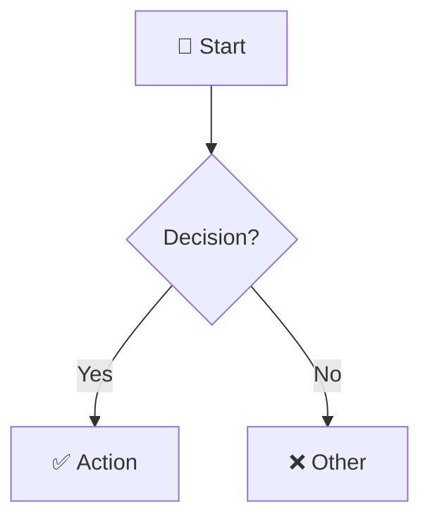
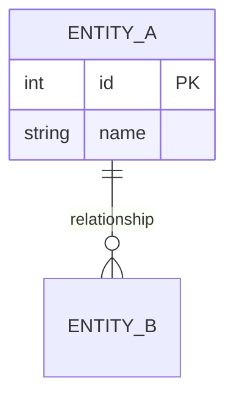
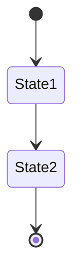

# 🔄 My Flow - Project Analysis Skill

## เมื่อไหร่ควรใช้ Skill นี้

ใช้ skill นี้เมื่อผู้ใช้ต้องการ:
- 📊 วิเคราะห์โครงสร้างโปรเจกต์
- 🔄 สร้าง System Flowchart
- 👤 สร้าง User Flow Diagram
- 📈 สร้าง Data Flow Diagram
- 🗄️ สร้าง ER Diagram
- 📝 ทำ Documentation ของระบบ

## 📋 ขั้นตอนการวิเคราะห์

### 1. อ่าน Documentation ก่อนเสมอ!

```bash
# ⚠️ ข้าม blog, content, posts - ไม่ใช่ docs ของโปรเจกต์
find . -maxdepth 3 -name "*.md" \
  ! -path "*/blog/*" ! -path "*/posts/*" ! -path "*/content/*" \
  ! -path "*/articles/*" ! -path "*/_posts/*" ! -path "*/news/*" \
  | head -20

# อ่าน README
cat README.md
```

### 2. หา Code Files

```bash
find . -type f \( -name "*.py" -o -name "*.js" -o -name "*.ts" -o -name "*.go" -o -name "*.rs" \) \
  ! -path "*/node_modules/*" ! -path "*/vendor/*" ! -path "*/dist/*" ! -path "*/target/*" \
  | head -50
```

### 3. วิเคราะห์ตามประเภท

| ต้องการ | ค้นหา | Output |
|---------|-------|--------|
| System Flow | routes, controllers, services | Architecture Diagram |
| User Flow | pages, forms, auth | User Journey Diagram |
| Data Flow | api, services, queue | Data Flow Diagram |
| ER Diagram | models, schema, migrations | ER Diagram |

## 🎨 Mermaid Templates

### Flowchart


### ER Diagram


### State Diagram


## 🎨 Color Guide

| Purpose | Color | Hex |
|---------|-------|-----|
| 🔵 Start/Input | Light Blue | `#e3f2fd` |
| 🟢 Success | Light Green | `#c8e6c9` |
| 🔴 Error | Light Red | `#ffcdd2` |
| 🟡 Warning/Process | Light Yellow | `#fff9c4` |
| 🟠 API Layer | Light Orange | `#fff3e0` |
| 🟣 Service Layer | Light Purple | `#f3e5f5` |

## ✅ Quality Checklist

- [ ] อ่าน README.md และ docs ก่อนเสมอ
- [ ] ไม่รวม blog/content/posts ในการวิเคราะห์
- [ ] Mermaid syntax ถูกต้อง render ได้
- [ ] ใช้ emoji ทำให้อ่านง่าย
- [ ] ใช้สีแยกแยะ layers
- [ ] ครอบคลุมทุก flow ที่สำคัญ
- [ ] ภาษาไทยในคำอธิบาย, อังกฤษใน diagram
